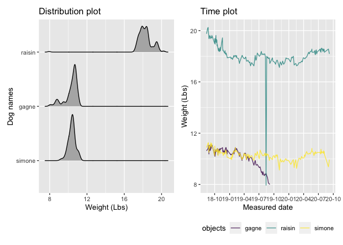

p8105\_mtp\_yl4362
================

``` r
library(tidyverse)
```

    ## ── Attaching packages ───────────────────────────────────────────────────────────────────────── tidyverse 1.3.0 ──

    ## ✓ ggplot2 3.3.2     ✓ purrr   0.3.4
    ## ✓ tibble  3.0.3     ✓ dplyr   1.0.2
    ## ✓ tidyr   1.1.2     ✓ stringr 1.4.0
    ## ✓ readr   1.3.1     ✓ forcats 0.5.0

    ## ── Conflicts ──────────────────────────────────────────────────────────────────────────── tidyverse_conflicts() ──
    ## x dplyr::filter() masks stats::filter()
    ## x dplyr::lag()    masks stats::lag()

``` r
library(readxl)
library(patchwork)
library(ggridges)
library(viridis)
```

    ## Loading required package: viridisLite

### Problem 1

``` r
raw_df = 
  read_excel("./data/dogweights_07sept2020.xlsx")
```

    ## New names:
    ## * `` -> ...2
    ## * `` -> ...3
    ## * `` -> ...4
    ## * `` -> ...5

``` r
view(raw_df)
```

In the raw data, there are 206 observations and 6 variables I want to
set the first row as the column names, convert `DATE` into meaningful
date format, convert weights into `numeric` data type and into uniform
unit (lbs), and record `notes` into another file.

1)  I import the dates and weights from the dogweights dataset and
    change column names into lower case.

<!-- end list -->

``` r
dog_weights_df = 
  read_excel("./data/dogweights_07sept2020.xlsx",
             sheet = "Sheet1", range = "B2:F207",
             col_types = c("date", "text", "text", "text", "text")) %>%
  janitor::clean_names() %>%
  drop_na(date) %>%
  pivot_longer(
    raisin:std,
    names_to = "objects",
    values_to = "weights") %>%
  separate(weights, into = c("lbs", "oz"), sep = " ") %>%
  mutate(
    weights_lbs = as.numeric(lbs) + as.numeric(oz)/16,
    date = as.Date(date)
  ) %>%
  select(!(lbs:oz))
```

    ## Warning in read_fun(path = enc2native(normalizePath(path)), sheet_i = sheet, :
    ## Expecting date in B79 / R79C2: got 's'

    ## Warning: Expected 2 pieces. Missing pieces filled with `NA` in 2 rows [157,
    ## 461].

I found the values of `date` were numeric rather than date format shown
in the excel. Thus, I used `col_types` to specify the types of each
column.

I got the warning `the date in B79 got 's'`, so I dropped `NA` value
under `date`.

I found the weight of dogs were recorded in `lbs oz` but they were
difficult for reading. Thus, I uniformed the weights into pounds.

2)  I create another dateframe to store the dates and notes from the
    dataset and change columnar names into lower case.

<!-- end list -->

``` r
notes_df = 
  read_excel("./data/dogweights_07sept2020.xlsx",
             sheet = "Sheet1", range = "B2:G207",
             col_types = c("date", "text", "text", "text", "text", "text")) %>%
  janitor::clean_names() %>%
  drop_na(date) %>%
  select(!(raisin:std)) %>%
  rename(notes = x6) %>%
  drop_na(notes)
```

    ## Warning in read_fun(path = enc2native(normalizePath(path)), sheet_i = sheet, :
    ## Expecting date in B79 / R79C2: got 's'

    ## New names:
    ## * `` -> ...6

I dropped `NA` value under `date` and separated `date` into `year`,
`month`, and `day`.

I found the column name `notes` was missed after importing data from row
2. Thus, I renamed the column name. I also dropped `NA` values under
`notes`.

3)  I export both dataframes as CSVs and store them into `data` folder.

<!-- end list -->

``` r
write.csv(dog_weights_df,"./data/dog_weights_df.csv")
write.csv(notes_df,"./data/notes_df.csv")
```

### Problem 2

``` r
view(dog_weights_df)
```

In `dog_weights_df` dataset, there are 816 observations and 3 variables,
including date, dog names, standard deviation of that day, and their
weights in pounds.

In `dog_weights_df`, there are 204 unique dates.

Below is a table summarizing the number of observations for each dog,
their average weight and the standard deviation.

``` r
dog_weights_df %>%
  filter(objects %in% c("raisin", "simone", "gagne")) %>%
  drop_na(weights_lbs) %>%
  group_by(objects) %>%
  summarize(num_obs = n(),
            avg_weight = mean(weights_lbs, na.rm = TRUE),
            std_weight = sd(weights_lbs, na.rm = TRUE),
            .groups = 'drop') %>%
  knitr::kable(digits = 2)
```

| objects | num\_obs | avg\_weight | std\_weight |
| :------ | -------: | ----------: | ----------: |
| gagne   |      119 |       10.29 |        0.71 |
| raisin  |      199 |       18.23 |        0.98 |
| simone  |      192 |       10.38 |        0.38 |

### Problem 3

``` r
distri_plot = 
  dog_weights_df %>%
  drop_na(weights_lbs) %>%
  filter(objects %in% c("raisin", "simone", "gagne")) %>%
  mutate(objects = forcats::fct_relevel(objects, c("simone", "gagne", "raisin"))) %>% 
  ggplot(aes(x = weights_lbs, y = objects)) +
  geom_density_ridges(scale = .85) +
  labs(
    title = "Distribution plot",
    x = "Weight (Lbs)",
    y = "Dog names"
  )

time_plot = 
  dog_weights_df %>%
  drop_na(weights_lbs) %>%
  filter(objects %in% c("raisin", "simone", "gagne")) %>%
  group_by(objects %in% c("raisin", "simone", "gagne")) %>%
  ggplot(mapping = aes(x = date, y = weights_lbs, color = objects)) + 
  geom_line(alpha = 0.8) +
  labs(
    title = "Time plot",
    x = "Measured date",
    y = "Weight (Lbs)"
  ) +
  viridis::scale_color_viridis(
    name = "objects", 
    discrete = TRUE
  ) +
  scale_x_date(
    date_breaks = "3 months",
    date_labels = "%y-%m"
  ) +
  theme(legend.position = "bottom")

distri_plot + time_plot
```

    ## Picking joint bandwidth of 0.145

<!-- -->

``` r
ggsave("distri_plot.pdf", distri_plot, width = 8, height = 5)
```

    ## Picking joint bandwidth of 0.145

``` r
ggsave("time_plot.pdf", time_plot, width = 8, height = 5)
```

The left `Distribution plot` shows the distribution of each dog’s
weights. We can see the weights of raisin are way higher than the other
dogs, while the weights of gagne and simone are similar.

The right `Time plot` shows the change of each dog’s weights through
time.

For raisin, from the beginning time to 2019-Jan, its weight declined
from 20 lbs to around 18 lbs. Then its weight kept relatively stable.
The extremely low value (\<8 lbs) in 2019-Aug may be an incorrect
record.

For simone, its weight kept relatively stable through all the time.

For gagne, its weight was stable in the initial time. But since
2019-Apr, its weight dropped consistently and eventually it didn’t have
any more record from 2019-Sep. From the note, we know that gagne died in
2019-Sep-8.
